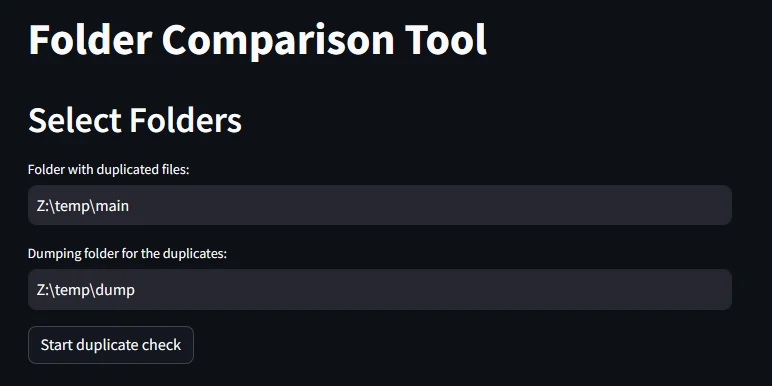
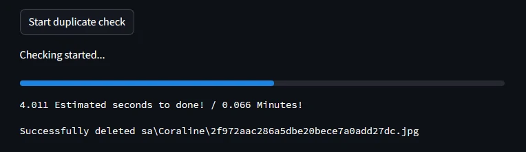
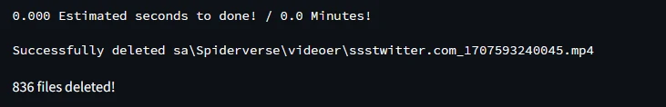

#  **Python duplicate checker using streamlit**

>  **Note**

>  If you're using any other OS than windows this will probaly not work, because it is depending on the python libary os which is made for windows only, [see this doc for more info](https://docs.python.org/3/library/os.html)

  

##  **Key Features**

  

*  Use two different folders *(One for the duplicates and another for dumping the registered duplicates into)*

*  Duplicates will not be deleted but moved to ensure that the wrong files isn't deleted

*  Loading bar showing the progress of searched files compared to files to search

-  With text that shows an estimate of time to run the task

*  End text that shows the checking has been complete and how many files have been transferred

* Utilizing Message Digest (MD5) to create hashes ensuring that at least **$2^{64}$ unique files** can be used while still being **blazing fast**

*  [Streamlit](https://streamlit.io/) library to UI

  
  

##  **Installation and setup**

  

To clone and run this application, you'll need [Git](https://git-scm.com) and [Python 1.12.2](https://www.python.org/downloads/?ref=gfxhacks.com) many other python version should work as well, but 1.12.2 was used for the creation of the script.

  

From your command line:

```bash

# Clone this repository

git  clone  https://github.com/BertramAakjaer/Python_duplicate_file_checker.git

  

# Install streamlit library

pip  install  streamlit

  

# Enter the directory

cd  Python_duplicate_checker-Streamlit/

  

# Run the script using streamlit and it should open in your default browser

python  -m  streamlit  run  main.py

```

##  **Usage**



  

**1.** Firstly go to your prefered file explorer and find the path to folder including duplicated files. Paste this into the first textbox named *"Folder with duplicates"*.

**2.** Then find a temporary folder to fill with all the registered duplicates and paste the path into the textbox named *"Destination folder"*.

**3.** Then you're ready and should just be able to press the button *"Start duplicate check"* and the program should do the rest for you.

  




## **Logic behind MD5 hashes**  
A [MD5 hash](https://en.wikipedia.org/wiki/MD5) is used instead of alternative like a [SHA1(Secure hash algoritm)](https://en.wikipedia.org/wiki/SHA-1), because of some distinct aspects that have led to the decision. The main point can be read under here:

- **Speed**
MD5 hashes are easily computed making the stress on the machine computing the hashes less impactful than other hash algorithms. This is really the main reason i choose a the MD5-hash algorithm, because it in general is one of the fastest to use while still having a decent hash size.

- **Hash size**
The hashes generated are big enough to create $2^{64}$ unique hashes which in general should be enough for this use case were you rarely have anywhere close to this number of files to compare.

- **Security**
MD5 hashes aren't that secure for use with passwords or other types of sensitive data, but when used for comparing files security aren't a factor that should be worrisome, so this tradeoff for greater speed are worth the price.


<br/>

*The point are gathered from an article comparing MD5 hashes and SHA1 hashes, it can be read here:*

- [Comparing MD5 and SHA1](https://www.geeksforgeeks.org/difference-between-md5-and-sha1/)


##  **License**

  

This project is licensed under the [MIT License](LICENSE).

  
  

##  **Socials**

>  [aakjaer.site](www.aakjaer.site) &nbsp;&middot;&nbsp;
>  GitHub [@BertramAakjær](https://github.com/BertramAakjaer) &nbsp;&middot;&nbsp;
>  Twitter [@BertramAakjær](https://twitter.com/BertramAakjaer)
